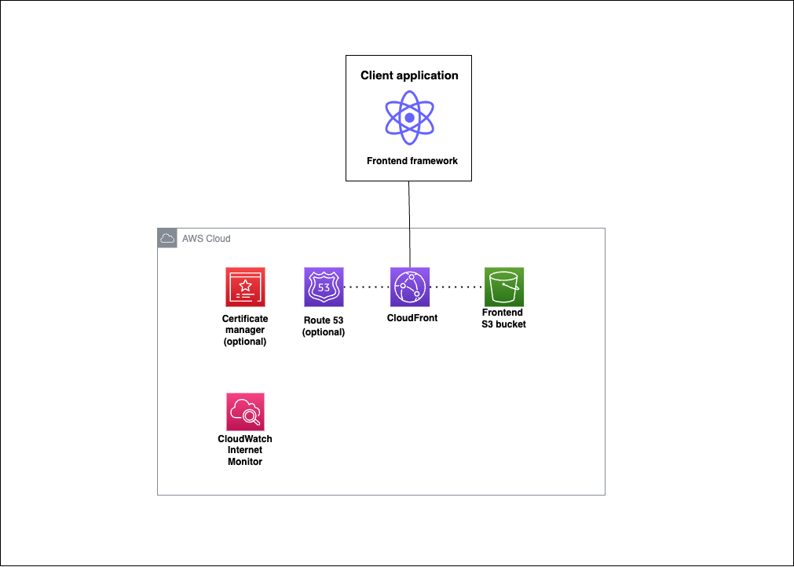

# Static Site Starter 

A static site starter template for setting up serverless projects using [AWS SAM](https://aws.amazon.com/serverless/sam/).

The project configures an S3 bucket with a CloudFront distribution to serve static content. The project also includes scripts to deploy, update, and delete the application stack. 


## Project structure 
The project is laid out with the all files in the root directory, but it is recommended that you add your frontend application source code and build directory to a `frontend` subdirectory.

```
project-root/
│
├─ frontend/
│   ├─ dist/
│   ├─ package.json
│   └─ ... (other frontend files and directories)
├─ template.yaml
├─ ... (other AWS SAM files and directories)
├─ deploy.sh
├─ .gitignore
└─ README.md
```

## Project architecture diagram 



A CloudFront distribution serves static content using the S3 bucket as the origin. The CloudFront distribution is configured to use the S3 bucket as the origin. These resources are always provisioned. 

Optionally users can can configure the template to use a custom domain name. If the user provides a Route53 Hosted Zone ID the template will edit an existing hosted zone. If the user does not provide a Route53 Hosted Zone ID the template will create a new one. An ACM certificate is created for the custom domain name which edits the hosted zone to add an Alias record for the CloudFront distribution.

CloudWatch Internet Monitor is used to monitor the health of the domain name. If the domain name does not respond to a request 3 times, the CloudWatch Internet Monitor will trigger an alarm. 

Although a frontend application is not included in the frontend starter 

## Requirements 

- [AWS CLI](https://aws.amazon.com/cli/) installed and configured with your AWS account credentials.
- [AWS SAM CLI](https://docs.aws.amazon.com/serverless-application-model/latest/developerguide/serverless-sam-cli-install.html) installed.

Using AWS Certificate Manager with a CloudFront distributions requires that the [stack be deployed in the `us-east-1` region](https://docs.aws.amazon.com/AmazonCloudFront/latest/DeveloperGuide/cnames-and-https-requirements.html). Since CloudFront is a global service, the distribution will be available in all regions and performant for users in all regions, for this reason the SAM template **must** be deployed in the `us-east-1` region

## Setup process
1. Clone the repository
```bash 
git clone https://github.com/fourTheorem/frontend-starter.git
cd frontend-starter
```

2. Build and deploy the SAM template
```bash
## package the template
`sam build`

## Deploy the template
## This will prompt you to add CloudFormation parameters
`sam deploy --guided`
```

3. Build your frontend application in the `frontend` directory and make sure the build files are in the `/frontend/dist`. 


This starter template can host any static websites or single page applications (like React). For examples on setting up a frontend using a framework such as React or Vue, you can view the [Vite Docs](https://vitejs.dev/guide/).

4. Deploy your frontend to the S3 bucket
```bash
chmod +x deploy.sh
./deploy.sh
```

This script assumes that your frontend build files are in the `/frontend/dist` directory. If your frontend build files are in a different directory, you can edit the `deploy.sh` script to point to the correct directory.


## Deploying the application

To build and deploy your application for the first time, run the following in your shell:

```bash
cd sam 
sam build
sam deploy --guided
```


## Remove application

```bash
cd sam 
sam remove --stack-name <stackName>
```

