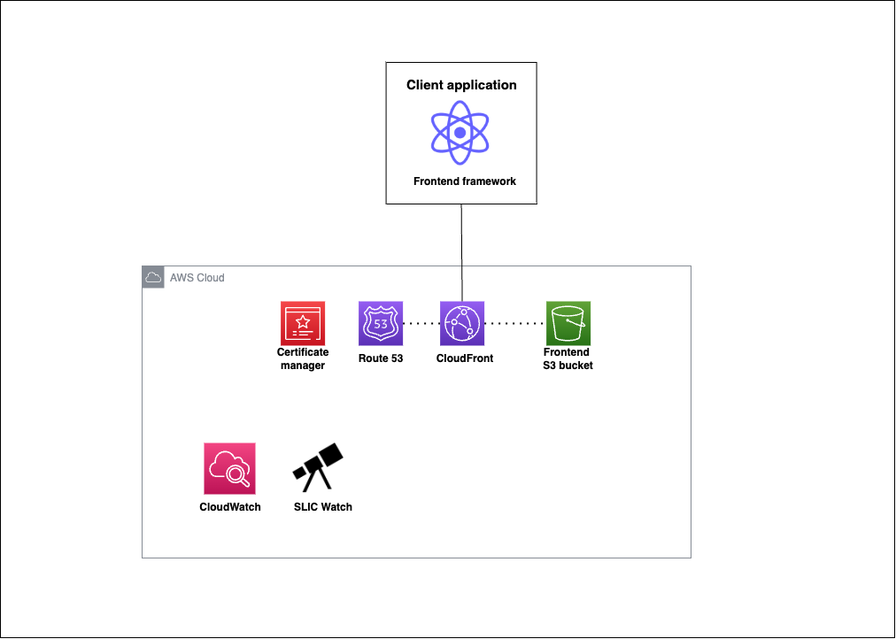

# Static Site Starter 

A static site starter template for setting up serverless projects using [AWS SAM](https://aws.amazon.com/serverless/sam/).

The project configures an S3 bucket with a CloudFront distribution to serve static content. The project also includes scripts to deploy, update, and delete the application stack. 


## Project structure 
The suggested project structure is as follows, where `frontend` contains your frontend application source code and build directory:

```
project-root/
│
├─ frontend/
│   ├─ package.json
│   └─ ... (other frontend files and directories)
│
├─ sam/
│   ├─ template.yaml
│   └─ ... (other AWS SAM files and directories)
│
├─ .gitignore
└─ README.md
```

## Project architecture diagram 



<!-- display frontend-starter.png -->


## Requirements 

- [AWS CLI](https://aws.amazon.com/cli/) installed and configured with your AWS account credentials.
- [AWS SAM CLI](https://docs.aws.amazon.com/serverless-application-model/latest/developerguide/serverless-sam-cli-install.html) installed.
- Requirements for your frontend application (ie. Node. NPM, etc.)

## Setup process
1. Clone the repository
```bash 
git clone https://github.com/fourTheorem/frontend-starter.git
cd frontend-starter
```

2. Build your frontend application in the `frontend` directory and make sure the build files are in the `/frontend/dist`. 

If you want to build a next.js application, you can use the following commands:
```bash
cd frontend
./setup.sh
```

3. [Add Slic-watch to your AWS account](https://github.com/fourTheorem/slic-watch#getting-started-with-aws-sam-cdk-or-cloudformation_)

Make sure you add it to the us-east-1 region. This SAM template must be deployed in that region. 


4. Build and deploy the SAM template
```bash
cd sam

## package the template
`sam package --output-template-file packaged.yaml --s3-bucket <frontend-bucketName>`

## deploy the template
`sam deploy --template-file packaged.yaml --stack-name <stackName> --capabilities CAPABILITY_IAM`
```

5. Deploy your frontend to the S3 bucket
```bash
# Set Region: CloudFront is global anyways and ACM is only available in us-east-1
AWS_REGION=us-east-1 
chmod +x deploy.sh
./deploy.sh
```


## Deploying the application

To build and deploy your application for the first time, run the following in your shell:

```bash
cd sam 
sam build
sam deploy --guided
```


## Remove application

```bash
cd sam 
sam remove --stack-name <stackName>
```

