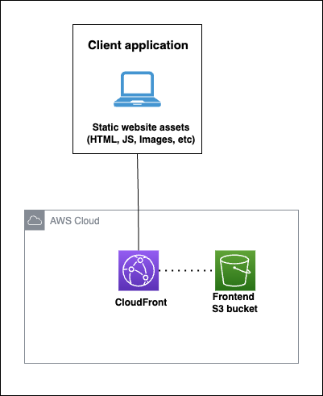
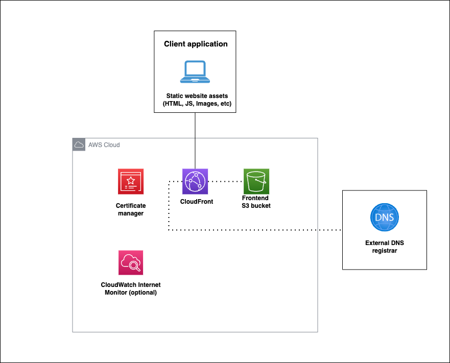
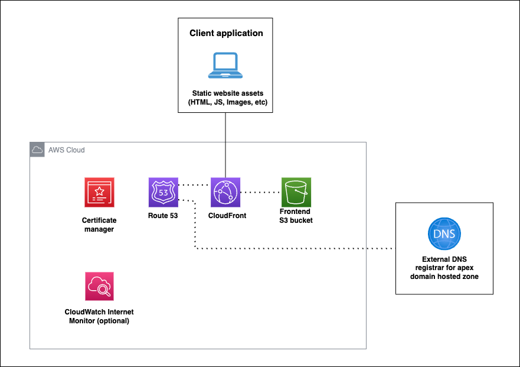

# Static site starter 

The project includes an [AWS SAM](https://aws.amazon.com/serverless/sam/) template that configures an S3 bucket with a CloudFront distribution to serve static content. The project also includes scripts to deploy, update, and delete the application stack. 


## Project structure 
The project is laid out with the all files in the root directory, but it is recommended that you add your frontend application source code and build directory to a `frontend` subdirectory.

```
project-root/
│
├─ frontend/
│   ├─ dist/
│   ├─ package.json
│   └─ ... (other frontend files and directories)
├─ template.yaml
├─ ... (other AWS SAM files and directories)
├─ deploy.sh
├─ .gitignore
└─ README.md
```

## Project architecture diagram 


A CloudFront distribution serves static content using the S3 bucket as the origin. The CloudFront distribution is configured to use the S3 bucket as the origin. These resources are always provisioned. 

Optionally users can can configure the template to use a custom domain name. If the user provides a Route53 Hosted Zone ID the template will edit an existing hosted zone. If the user does not provide a Route53 Hosted Zone ID the template will create a new one. An ACM certificate is created for the custom domain name which edits the hosted zone to add an Alias record for the CloudFront distribution.

CloudWatch Internet Monitor is used to monitor the health of the domain name. If the domain name does not respond to a request 3 times, the CloudWatch Internet Monitor will trigger an alarm. 

Although a frontend application is not included in the frontend starter 

## Requirements 

- [AWS CLI](https://aws.amazon.com/cli/) installed and configured with your AWS account credentials.
- [AWS SAM CLI](https://docs.aws.amazon.com/serverless-application-model/latest/developerguide/serverless-sam-cli-install.html) installed.

Using AWS Certificate Manager with a CloudFront distributions requires that the [stack be deployed in the `us-east-1` region](https://docs.aws.amazon.com/AmazonCloudFront/latest/DeveloperGuide/cnames-and-https-requirements.html). Since CloudFront is a global service, the distribution will be available in all regions and performant for users in all regions, for this reason the SAM template **must** be deployed in the `us-east-1` region

## Setup process
1. Initialise the project using the AWS SAM CLI
```bash 
sam init --location https://github.com/fourTheorem/static-site-starter.git
# You will now be prompted to set cookiecutter template values
# Please provide values for the following parameters:
#   project_name [your project name]:
#   project_description [Project description]:
cd <your project name> 
```

2. Build and deploy the SAM template
```bash
## package the template
`sam build`

## Deploy the template
## This will prompt you to add CloudFormation parameters
`sam deploy --guided`
```

3. Build your frontend application in the `frontend` directory and make sure the build files are in the `/frontend/dist`. 


This starter template can host any static websites or single page applications (like React). For examples on setting up a frontend using a framework such as React or Vue, you can view the [Vite Docs](https://vitejs.dev/guide/).

4. Deploy your frontend to the S3 bucket
```bash
chmod +x deploy.sh
./deploy.sh
```

This script assumes that your frontend build files are in the `/frontend/dist` directory. If your frontend build files are in a different directory, you can edit the `deploy.sh` script to point to the correct directory.


## Deploying the application

To build and deploy your application for the first time, run the following in your shell:

```bash
cd sam 
sam build
sam deploy --guided
```


## Remove application

```bash
cd sam 
sam remove --stack-name <stackName>
```

# Costs
When using this template, you will be billed depending on the number of requests to the S3 bucket and CloudFront distribution, and the number of times the CloudWatch Internet Monitor checks the CloudFront distribution. For small websites that won't receive heavy traffic most of these services will fall under the free tier.

It is worth noting that CloudWatch Internet Monitor is the most expensive service by far for hosting a small site. 

Here is a sample cost estimate for a website with 1GB of static assets that recieves 1000 views per month:
https://calculator.aws/#/estimate?id=dcf37a539e4761fa0af292a5858f17c1967275bf


## Deploying an application without a custom domain name 
This is the simplest way to deploy an application.



1. Set the CloudFormation parameters 'DomainName', 'ACMCertificateArn', and 'ExistingHostedZoneID' to empty strings
2. Deploy the stack 
3. Access the website at the CloudFront distribution url outputted from the CloudFormation stack


## Deploying an application using a DNS hosted zone that is not managed by Route53


1. Set the CloudFormation parameter 'DomainName' to the subdomain of your app (eg. 'example.com')
2. Set the CloudFormation parameters 'ACMCertificateArn' and 'ExistingHostedZoneID' to empty strings
3. Deploy the template
4. Log into the DNS registrar to access the domain name's hosted zone
5. Create a new CNAME record for the domain name that points to the CloudFront distribution url (this is an output of the CloudFormation stack)
6. Validate the domain name:
  - Go to the ACM console after the stack has been deployed
  - Localte a newly creatd certificate for the domain name
  - Click the 'Actions' button and select 'Validate certificate'
  - Follow the instructions to validate the domain name manually


These changes will take a few minutes to propagate, then you should be able to access the website at `example.com` when you deploy your site to the S3 frontend bucket.

## Deploying your application as a subdomain where the apex domain name hosted zone is managed by a 3rd party registrar




1. Set the CloudFormation parameter 'DomainName' to the subdomain of your app (eg. 'subdomain.example.com')
2. Deploy the template
2. Log into the DNS registrar for the apex domain name
3. Create a CNAME record for the subdomain that points to the CloudFront distribution url (this is an output of the CloudFormation stack)

The new record's values should look like this:
```
Name: subdomain.example.com
Type: CNAME
Value: dxxxxxxxxxxxxx.cloudfront.net
```
These changes will take a few minutes to propagate, then you should be able to access the website at `subdomain.example.com` when you deploy your site to the S3 frontend bucket.